# 1. Introduction:
In this project, we would use SQL using the Microsft SQL Server DBMS to export specific dataset from the main database (International Sales Database) using SQL queries, then we would use Python using Jupyter Notebook to analyze the exported dataset through cleaning it, then describe statistical characteristics (Mean - Median - IQR - Min - Max), dealing with outliers using (Pandas Library), and finally visualize the data using different python libraries such as (Matplotlib - Seaborn - Plotly), to show different trends and patterns from between the data.

You can see all SQL queries for the project here: [SQL_Queries folder](/SQL_Queries/), and Python Jupyter Notebooks here:[Python_Analysis](Python_Analysis).

# 2. Tools I Used:
To thoroughly explore the data analyst job market, I utilized the capabilities of a range of essential tools:
1. **SQL:** allowing me to query the database and explore critical insights.
2. **Microsoft SQL Server:** database management system.
3. **Python:** as it a powerhouse in data analysis, thanks to its simplicity, flexibility, and the vast array of libraries it offers.
4. **Visual Studio Code:** for database management and executing SQL queries, and for Python coding for analysis.
5. **Jupyter Notebook:** It is an interactive web-based environment that allows users to create and share documents containing live code, visualizations, and narrative text, using Python language.
6. **Git & GitHub:** for sharing my SQL and Python analysis and interpretation.

# 3. SQL Queries Analysis (Microsoft SQL Server & VS Code):

### **3.1. Create Datebase:**
- Create a Database (InternationalCompanySalesData) to Upload Data from the Excel Sheet on it,
by Using (SQL Server Import and Export Wizard) to Import Data Into Database.
- Make Sure That All Columns in All Tables Have The Suitable Data Type.
- Before Finish Import Data Into Database.

```sql
USE MASTER;
GO

CREATE DATABASE InternationalCompanySalesData;
```
### **3.2. Import Data to Database Using SQL Server Import and Export Wizard:**

### **3.3. Extract Full Join Data Set:**
- Extract Full Join Data from tables (Customer - Order - Product - Supplier) into one table to analyze it using Python.
```sql
USE InternationalCompanySalesData;
GO

SELECT 
    C.*, O.*, P.*, S.*
FROM
    Customer AS C
    FULL JOIN [Order] AS O ON C.Id = O.CustomerId
    FULL JOIN OrderItem AS OI ON O.Id = OI.OrderId
    FULL JOIN Product AS P ON OI.ProductId = P.Id
    FULL JOIN Supplier AS S ON P.SupplierId = S.Id;
```
# 4. Python Analysis (VS Code & Jupyter Notebook):
- First, we would export the result from the last SQL query into a CSV file, then read it in VS Code using the Python pandas library to import it as a dataframe to start analysis on it.
- Second, we would inspect the dataframe to find all dataframe problems to clean and fix it.
- Third, we would start the Data Exploratory step, through Univariate, Bivariate, and Multivariate analysis, using suitable plots and charts to discover different patterns and trends between data.
- We can summarize the steps of the analysis using Python into this chart:

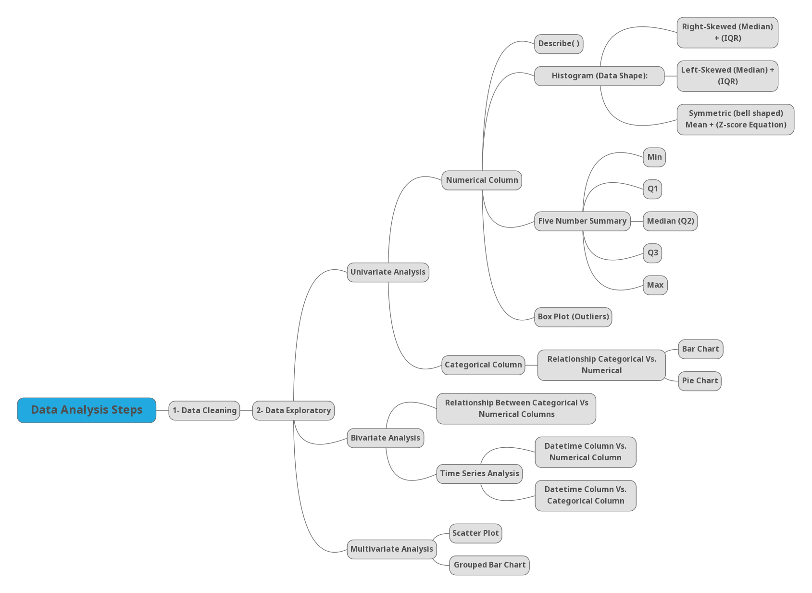

### **4.1. Data Cleaning Step:**  
- In this step, we should check our dataframe column's data type, check the columns' name, and nan- values, and check the numerical and categorical columns to fix any problems before analysis.   
- After we checked the dataframe, we found these issues.

**Issues**:

**1- Delete Rows With Nan OrderId Values:**
```python
df_copy = df_copy[df_copy["OrderId"].notna()]
```
**2. Change the Data Type of the OrderDate Column from Object (String) to Datetime Data Type:**
```python
df_copy["OrderDate"] = pd.to_datetime(df_copy["OrderDate"])
```
**3. Change the Data Type of Columns (CustomerId - OrderId - OrderNumber - ProductId - SuplierId) from Float to Integer Data Type:**
```python
change_columns = ["CustomerId", "OrderId", "OrderNumber", "ProductId", "SupplierId"]
for column in list(df_copy.columns):
    if column in change_columns:
        df_copy[column] = df_copy[column].astype(int)
```
**4. Rename Columns (City.1 - Country.1 - Phone.1) as They Similar to Previous Columns:**
```python
df_copy.rename(columns={
    "City.1":"SupplierCity",
    "Country.1":"SupplierCountry",
    "Phone.1":"SupplierPhone"
}, inplace=True)
```

- Then, we would create a function collecting all data cleaning steps in one function to save time in the next analysis steps 

**5- Create Function Wrang (Data Wrangling) With Optional Variables (None):**
```python
def wrang(
    dataframe,
    encoding = None,
    dropnanvalues = None,
    duplicatevlues = None,
    datecolumn = None,
    renamedcolumns = None  
):
    # Loading Data From CSV File:
    df = pd.read_csv(dataframe, encoding= encoding)

    # Drop Nan Value Of Specific Columns:
    df.dropna(subset=dropnanvalues, inplace=True)

    # Remove Duplicates From Specific Columns:
    df.drop_duplicates(subset=duplicatevlues, inplace=True)

    # Convert Date Column From Object to Datetime:
    df[datecolumn] = pd.to_datetime(df[datecolumn])

    # Rename Columns Names:
    df.rename(columns= renamedcolumns, inplace=True)

    # Stripe and Lowercase Columns Names:
    df.columns = df.columns.str.strip().str.lower()
    return(df)    
```
**6- Create New Dataframe (Orders) By Using Wrang User-Defined Function to use this Dataframe as Main Dataframe In all Next Steps:**
```python
orders = wrang(dataframe="Full_Join_Data.csv",
               encoding="latin-1",
               dropnanvalues=["OrderId"],
               duplicatevlues="OrderId",
               datecolumn="OrderDate",
               renamedcolumns={"City.1":"SupplierCity", "Country.1":"SupplierCountry", "Phone.1":"SupplierPhone"})
```
**7- Then We Would Convert columns ["customerid", "orderid", "ordernumber", "productid", "supplierid"], to Integer Data Type:**
```python
columns_edit = ["customerid", "orderid", "ordernumber", "productid", "supplierid"]
for column in list(orders.columns):
    if column in columns_edit:
        orders[column] = orders[column].astype(int)
```
### **4.2. Data Exploration Step (Exploratory Data Analysis "EDA"):** 
 - Data exploration is a main step in data analysis involving the use of data visualization tools and statistical techniques to uncover data set characteristics and initial patterns.

### **1- Univariate Analysis:**

**Analysis Quantitative Column In The Data (totalamount):**

**(1) Descriptive Statistics Summary:**

- We use describe method to find Descriptive statistics about Dataframe:
```python
orders["totalamount"].describe()
```
```
| Statistic | Value       |
|-----------|-------------|
| count     | 830.000000  |
| mean      | 1631.877819 |
| std       | 1990.613963 |
| min       | 12.500000   |
| 25%       | 480.000000  |
| 50%       | 1015.900000 |
| 75%       | 2028.650000 |
| max       | 17250.000000|
```
**(2) Data Shape Using (Histogram):**

**Using Plot( ) Function of Pandas Library:**

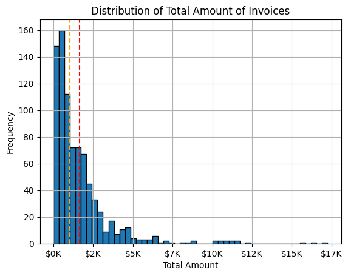

**Histogram Shape Analysis:**

- First, the shape of the curve is (Right-Skewed) or (Positive-Skewed).

- In this case, the mean is more than the median (mean > median).

- We note that most of our data in the histogram is concentrated in the left side.

- We note that the median (black line) is closer to most data on the left side.

- Unlike mean which is closer to higher values data which is right skewed of the curve.

- So, the median in this case is more accurate and can be used in measure of the center.

**(3) Five Number Summary: (Min - Q1 - Median(Q2) - Q3 - Max) Using (Box Plot):**

**Five Number Summary:**
- We used five number summary to find the outliers in our data, a five-number summary simply consists of the smallest data value (Min), the first quartile (Q1), the median (Q2), the third quartile (Q3), and the largest data value (Max). 
    -	Min
    -	Q1
    -	Median
    -	Q3
    -	Max
```python
Min = orders["totalamount"].min()
Q1 = orders["totalamount"].quantile(0.25)
Q2 = orders["totalamount"].median()
Q3 = orders["totalamount"].quantile(0.75)
Max = orders["totalamount"].max()
```

**IQR:**

- Interquartile range tells you the spread of the middle half of your distribution.

    - Q1 = 25% of the dataset.
    - Q2 = Median = 50% of the dataset.
    - Q3 = 75% of the dataset.
    - IQR = Q3 – Q1
    - Lower Boundary = Q1 – (1.5 * IQR)
    - Upper Boundary = Q3 + (1.5 * IQR)
- Outliers are the values that is less than or equal lower boundary and more than or equal upper boundary.
```python
IQR = Q3 - Q1
lower_boundary = Q1 - (1.5 * IQR)
upper_boundary = Q3 + (1.5 * IQR)
```
**Box Plot:**

**Using Plotly Library:**

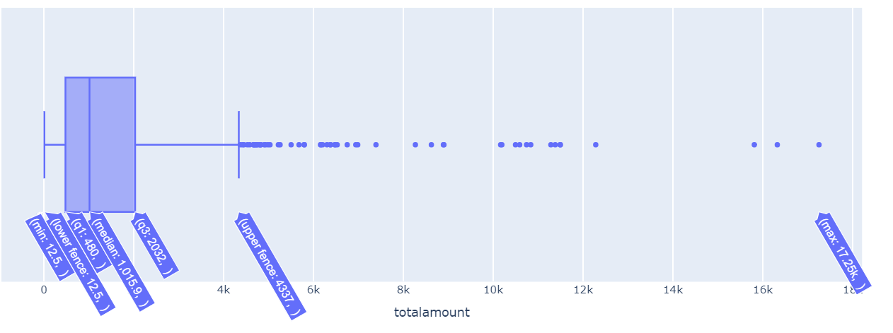

**Using Seaborn Library:**

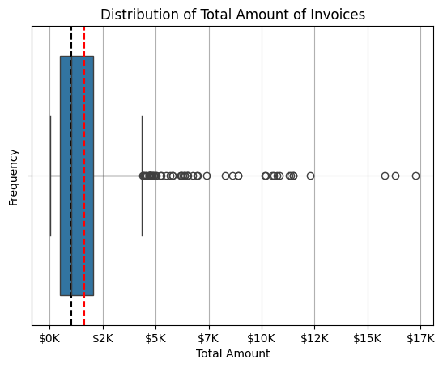


**Combination Of Histogram Chart and Box Plot Chart Showing Invoices Amount Distribution**

```python
fig, ax = plt.subplots(2,1)
fig.tight_layout(h_pad=2)

def salaryFormat(x, position):
    return(f"${int(x / 1000)}K")

ax[0].hist(x=orders["totalamount"], bins=30, edgecolor="black")
ax[0].set_title("Distribution of Total Amount of Invoices")
ax[0].xaxis.set_major_formatter(plt.FuncFormatter(salaryFormat))
ax[0].axvline(x=(orders["totalamount"]).median(), color="red", linestyle="--", label="Median")
ax[0].axvline(x=(orders["totalamount"]).mean(), color="black", linestyle="--", label="Mean")
ax[0].axvline(x=(orders["totalamount"]).quantile(0.25), color="yellow", linestyle="--", label="Q1")
ax[0].axvline(x=(orders["totalamount"]).quantile(0.75), color="yellow", linestyle="--", label="Q3")
ax[0].legend(loc="upper right")

ax[1].boxplot(x=orders["totalamount"], vert=False)
ax[1].set_yticks([])
ax[1].xaxis.set_major_formatter(plt.FuncFormatter(salaryFormat))
ax[1].set_xlabel("Total Amount In (USD$)")
ax[1].axvline(x=(orders["totalamount"]).median(), color="red", linestyle="--")
ax[1].axvline(x=(orders["totalamount"]).mean(), color="black", linestyle="--")
ax[1].axvline(x=(orders["totalamount"]).quantile(0.25), color="yellow", linestyle="--")
ax[1].axvline(x=(orders["totalamount"]).quantile(0.75), color="yellow", linestyle="--")
```
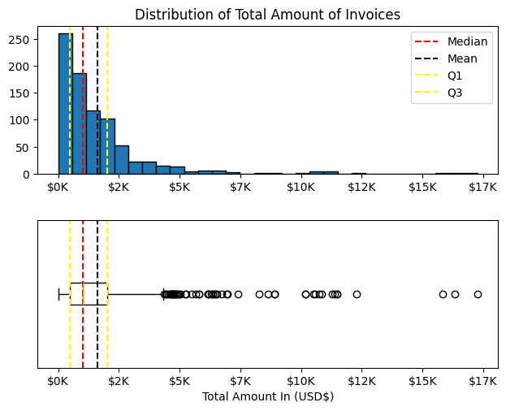

**Box Plot Analysis:**

- From the box plot and five-number summary analysis, we note that the upper boundary is almost equal = 4351.625.

- The number of rows (invoices) that are bigger or equal to the upper boundary is 56 rows (invoices).

- In fact, I see that 56 rows to be considered outliers is not correct compared to the total number of rows of the dataframe (830).

- The second reason is due to the values from 4K to 15K are close together, which means that the difference between them is small.

- In this case, I will consider that values more than 15K are considered outliers, as their values are differentiated more.

**Dealing With Ouliers:**
- Total Number of Rows >= Upper Boundary = 3 Rows
- Total Number of Rows <= Lower Boundary = 0 Rows
```python
orders = orders[orders["totalamount"] < 15000]
```
**Analysis Qualitative (Categorical ) Data Exploratory:**

**Bar Chart Analysis:**

**City Column Analysis Using Bar Chart:**

**1-Using Plot( ) Function of Pandas Library:**


**2-Using Matplotlib Library:**


**City Bar Chart Analysis:**
1. **Cities with High Counts:**
   - The two cities dominating this chart are London and Rio de Janeiro because they have an extremely high count, far ahead of other cities.
   - The next tier of cities with considerable high counts includes São Paulo, Boise, and Cunevaldez.

2. **Sharp Descent After the Top Cities:**
   - After top five, the count comes down sharply. Other cities also tend to show a gradual downward trend.

3. **Potential Categories for Investigation or Impact:**
   - The data would almost suggest that businesses or initiatives with such a dataset will probably find the top 10 cities beneficial for impact. On the other hand, the tail-end of the cities may prove interesting for countries with niche opportunities.

**Country Column Analysis Using Bar Chart:**

**1.Using Seaborn Library:**

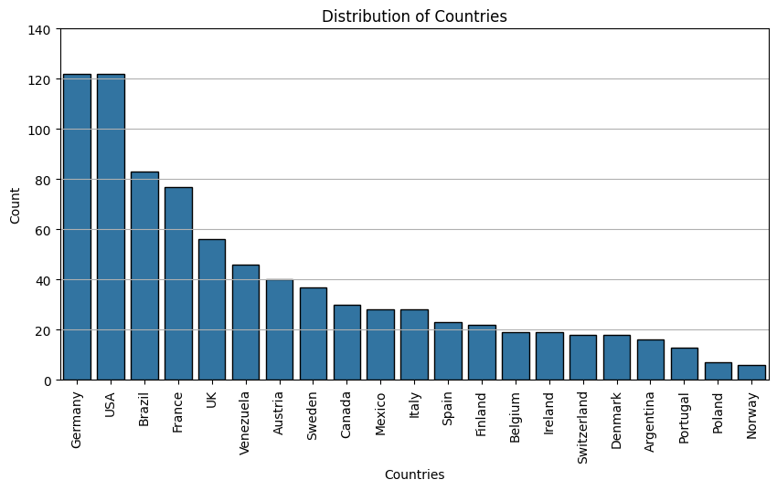

**2.Using Plotly Library:**

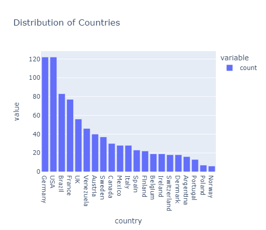

**Countries Bar Chart Analysis:**
- With top two absolute counts which are more than any other country, **Germany** and **USA** turned out to be the topmost countries in the bar chart.
- The top three were followed by **Brazil**, **France**, and the **UK**.
- After the top five countries in the chart, the counts see a steady declining trend that has gone much closer to even representation in mid-tier countries, such as **Venezuela**, **Austria**, and **Sweden**. 
- Countries like **Argentina**, **Portugal**, **Poland**, and **Norway**, together add very little to the total counts, but add variety to the dataset.
- This data has countries across continents, besides covering Europe and America; it appears to be a worldwide dataset.
- Germany and the USA are critical areas, again by counts, but also by the indications of the chart showing possibilities to look beyond the high counts into mid-tier countries.

**Country Column Analysis Using Pie Chart Using Matplotlib Library:**
```python
plt.figure(figsize=(15, 8))
country_chart.plot(
    kind="pie",
    startangle=90,
    autopct="%1.1f%%",
    legend=True,            
)
plt.title("Country-wise Order Distribution", fontsize=16)
plt.tight_layout()
plt.ylabel(" ")

```


**Pie Chart Analysis:**
- Through the preliminary analysis, we see that London is the city that has the largest share of purchasing our products with 46 invoices, but Germany and United States are the the most purchasing countries for dataset products with 121 invoices and 14.7% of our total sales.

### **2- Bivariate Analysis:**

**(1) Countries Vs. Total Amount:**

**Bar Chart:**

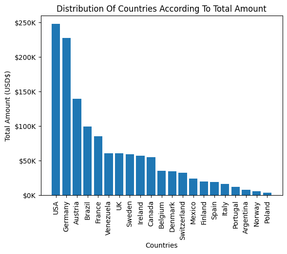

**Pie Chart**

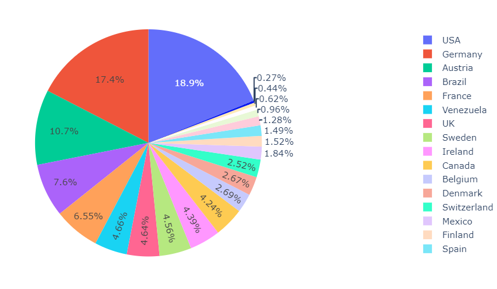

**Analysis:**
* **USA** has the highest "Total Amount" by a considerable margin.
* **Germany** and **Austria** follow in the second and third positions, respectively.
* Countries like **Brazil**, **France**, **Venezuela**, and **UK** fall into the mid-range category, with their "Total Amounts" being lower than the top three but still higher than many others.
* The majority of countries in the chart, including **Sweden**, **Ireland**, **Canada**, and **Belgium**, have relatively lower "Total Amounts."
* There's a significant difference in the "Total Amounts" between the top-ranking countries and the rest.
* The distribution appears to be somewhat clustered, with a few countries in the higher range, a larger group in the mid-range, and a smaller group in the lower range.

**(2) Cities Vs. Total Amount Bar Chart:**

**Bar Chart:**

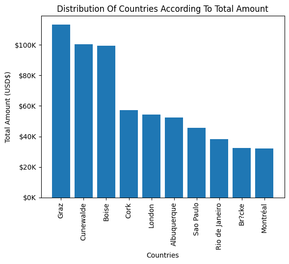

**Pie Chart**

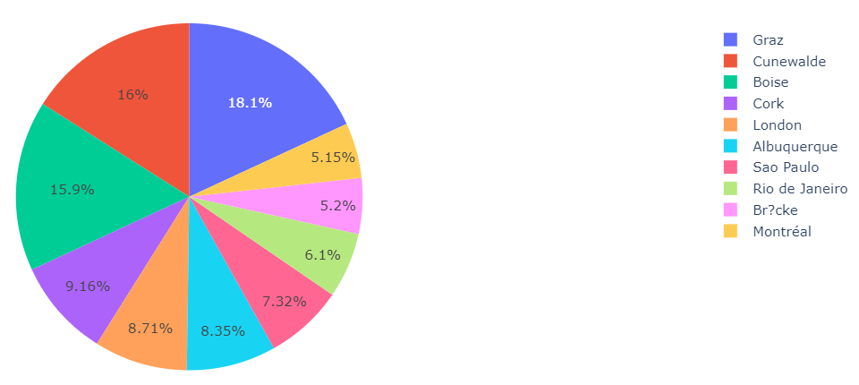

**Analysis:**
* **Graz** has the highest "Total Amount" by a considerable margin.
* **Cunewalde** and **Boise** follow in the second and third positions, respectively.
* Cities like Cork**, **London**, and **Albuquerque** fall into the mid-range category, with their "Total Amounts" being lower than the top three but still higher than many others.
* The majority of cities in the chart, including **Sao Paulo**, **Rio de Janeiro**, **Br?cke**, and **Montréal**, have relatively lower "Total Amounts."
* There's a significant difference in the "Total Amounts" between the top-ranking cities and the rest.
* The distribution appears to be somewhat clustered, with a few cities in the higher range, a larger group in the mid-range, and a smaller group in the lower range.

**Time Series Analysis (Order Date Analysis):**

**Relationship Between Order Date & Total Amount:**

**Using Matplotlib Library:**

```python
plt.figure(figsize=(15,5))
plt.plot(orders["orderdate"], orders["totalamount"])
plt.tight_layout()
ax = plt.gca()
ax.yaxis.set_major_formatter(plt.FuncFormatter(lambda y, position: (f"${int(y / 1000)}K")))
```

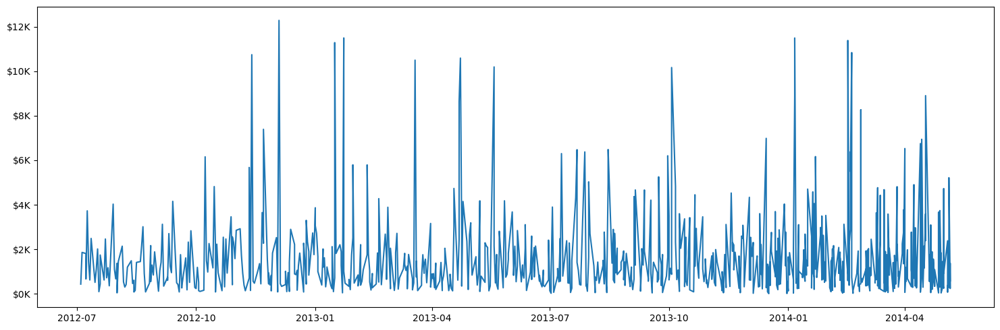

**Time Series Plot Analysis:**

- The "Total Amount" exhibits significant fluctuations over time, suggesting a dynamic and unpredictable trend.

- The plot doesn't reveal a consistent upward or downward trend, indicating that the "Total Amount" might be influenced by various factors that are not easily predictable.

- There might be some seasonal patterns, but they are masked by the high volatility. Further analysis with statistical techniques could confirm the presence of seasonality.

- The plot contains several data points that deviate significantly from the general trend, suggesting the presence of outliers. These outliers could be due to specific events, anomalies, or measurement errors.


**Unique Country Count Per Month Analysis:**

**Using Matplotlib Library:**
```python
plt.figure(figsize=(15,6))
plt.plot(dateCountry1M["country"], dateCountry1M["ordermonth"])
plt.tight_layout()
plt.title("Frequency Of Unique Country Per Month")
plt.xlabel("Unique Country Frequency")
plt.ylabel("Month-Year")
```

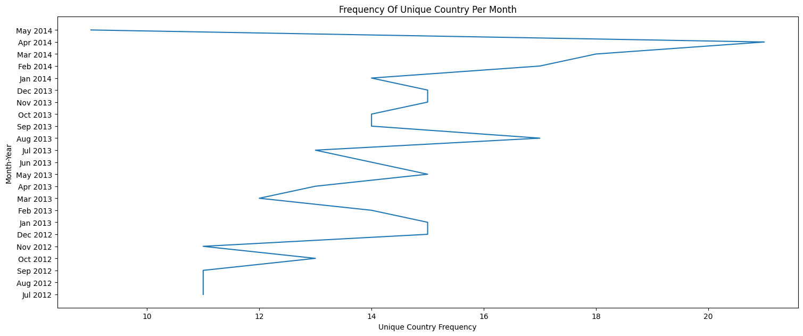

**OR:**

```python
plt.figure(figsize=(15,6))
plt.plot(dateCountry1M["ordermonth"], dateCountry1M["country"])
plt.tight_layout()
plt.title("Frequency Of Unique Country Per Month")
plt.xlabel("Unique Country Frequency")
plt.ylabel("Month-Year")
plt.xticks(rotation=45, ha="right")
```
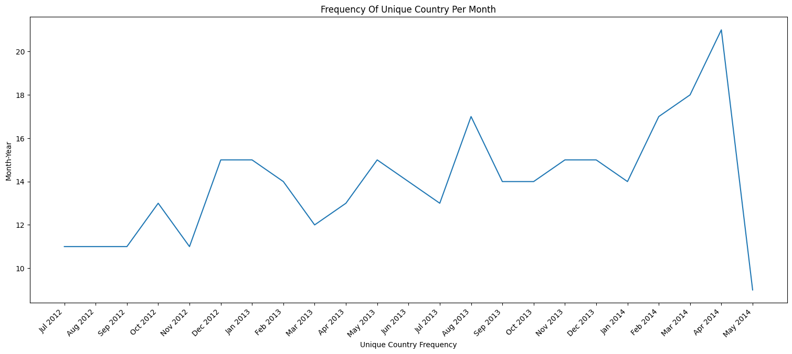


**Analysis:**
* There seems to be a slight dip in unique country frequency during these months, indicating a potential seasonal variation. This could be due to factors like weather conditions or holiday seasons affecting travel and data collection.
* A peak in unique country frequency is observed during these months, suggesting increased activity or data collection during this period.
* **2012:** The year starts with a relatively low frequency of unique countries and gradually increases towards the end of the year.
* **2013:** This year shows a more pronounced upward trend, with peaks in the summer months and dips in the winter months.
* **2014:** The trend continues upward, with a significant peak in May 2014. This could be due to a specific event or campaign that attracted a diverse range of countries.

**Top Customers (Paying & Invoices Frequency):**

**Bar Chart:**

**Using Matplotlib Library:**

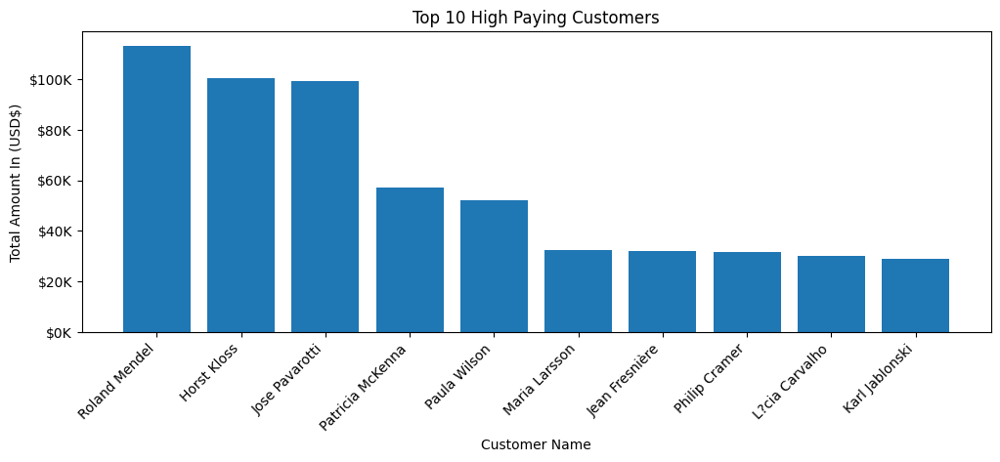

**Using Plotly Library:**

```python
px_bar = px.bar(data_frame=customer_group,
       x="fullname",
       y="totalamount",
       text_auto=True,
       title="Top 10 High Paying Customers",
       labels={
           "fullname" : "Customer Name",
           "totalamount" : "Total Amount"
       },
       )

px_bar.update_traces(
    marker_color="rgb(255,73,0)",
    marker_line_color="rgb(255,73,0)",
    marker_line_width=1.5,
    textposition="inside",
    opacity=0.7
)

```
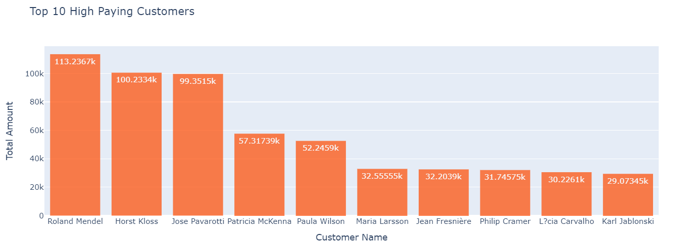

**Horizontal Bar Chart Using Matplolib Library:**
```python
plt.figure(figsize=(12,4))
plt.barh(y=customer_group["fullname"], width=customer_group["totalamount"])
plt.title("Top 10 High Paying Customers")
plt.xlabel("Customer Name")
plt.ylabel("Total Amount In (USD$)")

ax = plt.gca()
ax.invert_yaxis()
ax.xaxis.set_major_formatter(plt.FuncFormatter(lambda x, position: (f"${int(x / 1000)}K")))
```

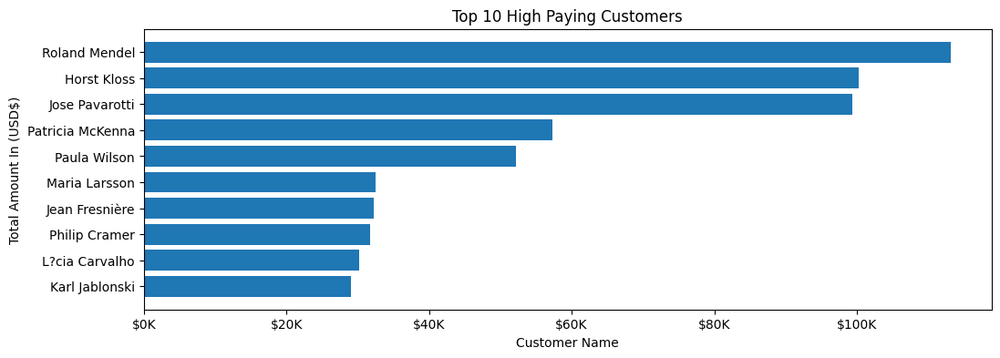

**Analysis:**
- From the analysis of the chart, the top five customers according to total amount:

**1. Roland Mendel:** 
* **Total Amount:** $110,000 (USD).
* **Ranking:** First place

**2. Horst Kloss:**

* **Total Amount:** $100,000 (USD)
* **Ranking:** Second place

**3. Jose Pavarotti:**

* **Total Amount:** $100,000 (USD)
* **Ranking:** Third place

**4. Patricia McKenna:**

* **Total Amount:** $95,000 (USD)
* **Ranking:** Fourth place

**5. Paula Wilson:**

* **Total Amount:** $60,000 (USD)
* **Ranking:** Fifth place


**Relation Between Customer Full Name & Count of Invoices:**

**Using Matplotlib Library:**


**Using Plotly Library:**
```python
px_bar = px.bar(data_frame=customer_count,
       x=customer_count.index,
       y=customer_count.values,
       text_auto=True,
       title="Customers Invoices Count",
       )

px_bar.update_traces(
    marker_color="rgb(255,73,0)",
    marker_line_color="rgb(255,73,0)",
    marker_line_width=1.5,
    textposition="inside",
    opacity=0.7
)
```


**Horizontal Bar Chart Using Matplolib Library:**
```python
plt.figure(figsize=(12,4))
plt.barh(y=customer_count.index, width=customer_count.values)
plt.title("Customers Invoices Count")
plt.xlabel("Customer Name")
plt.ylabel("Frequency")

ax = plt.gca()
ax.invert_yaxis()
```
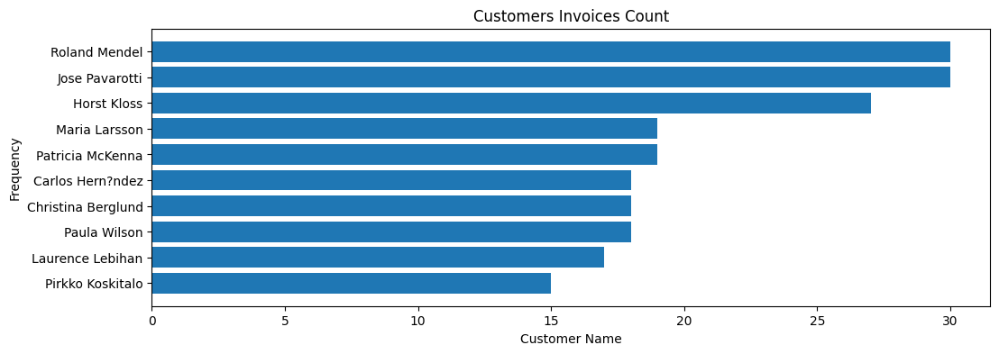

**Analysis:**

**1. Roland Mendel:**

* **Invoices Count:** 30
* **Ranking:** First place

**2. Jose Pavarotti:**

* **Invoices Count:** 30
* **Ranking:** Second place

**3. Horst Kloss:**

* **Invoices Count:** 30
* **Ranking:** Third place

**4. Maria Larsson:**

* **Invoices Count:** 28
* **Ranking:** Fourth place

**5. Patricia McKenna:**

* **Invoices Count:** 20
* **Ranking:** Fifth place

### **3- Multivariate Analysis:**

**Analysis Of Three Variables (Order Date - Country - Total Amount):**

**Scatter Plot:**

**Using Matplotlib Library:**
```python
plt.scatter(data=country_per_month_name,
            x="country_count",
            y="total_amount",
            s=20,
            c="red",
            alpha=1,
            marker="^")

texts_list = []

for index, row in country_per_month_name.iterrows():
    texts_list.append(plt.text(row["country_count"], row["total_amount"], index))

ax = plt.gca()
adt.adjust_text(texts=texts_list, arrowprops=dict(arrowstyle="->", color="r", lw=1))
ax.yaxis.set_major_formatter(plt.FuncFormatter(lambda y, position: f"${int(y / 1000)}K"))
plt.title("Distribution Of Country Count & Total Amount")
plt.ylabel("Total Amount")
plt.xlabel("Country Count")
plt.tight_layout()
```


**Grouped Bar Chart With Color Intensity Representing a Categorical Variable (Country Frequency):**

**Using Plotly Library:**

```python
px_bar = px.bar(data_frame=country_per_month,
       x=country_per_month.index,
       y=country_per_month["total_amount"],
       title="Distribution Of Country Frequency & Total Amount",
       labels=({"total_amount":"Total Amount", "orderdate":"Month"}),
       text_auto=True,
       color=country_per_month["country_count"]
       )

px_bar.update_layout(title_x=0.5)
px_bar.update_traces(textposition="outside")
```


**Grouped Bar Chart Analysis:**
1. **Steady Growth Over Time**:  
   The total amount shows a consistent upward trend, with notable increases in early 2013 and a significant peak in early 2014. This suggests sustained growth, possibly driven by business expansion or market penetration.

2. **Correlation Between Total Amount and Country Count**:  
   Bars with lighter colors (higher `country_count`) correspond to higher total amounts. This indicates that broader international participation or engagement correlates with higher revenue or performance metrics.

3. **Notable Spikes in Specific Periods**:  
   Key months such as **January 2013**, **October 2013**, and **January-April 2014** exhibit substantial increases in total amount. These periods could represent seasonal trends, successful campaigns, or key market activities.

4. **Peak Performance in April 2014**:  
   April 2014 recorded the highest total amount (~118.307k), accompanied by a high `country_count`. This suggests a culmination of efforts like marketing drives, new product launches, or expanded geographical outreach.

5. **Enhanced Data Presentation**:  
   The inclusion of annotations with exact amounts on the bars provides clear and precise data interpretation, making it easier to compare monthly performance. The color gradient effectively ties the `country_count` variable to the total amount, adding depth to the analysis.

### **Multivariate Analysis (Advanced Scatter Plot):**

**Using Plotly Library:**

```python
px.scatter(data_frame=month_country_group,
           x="monthyear",
           y="total_amount_sum",
           color="country",
           size="total_amount_sum",
           labels={
               "monthyear":"Month - Year",
               "total_amount_sum":"Total Amount In (USD$)"
           },
           title="Total Amount Sum Variation Across Countries from January 2012 to May 2014")
```


**Advanced Scatter Plot Analysis:**
1. The chart illustrates the total amount each country had throughout the period from January 2012 to May 2014.
2. Each country has a different color on the plot that distinguishes one country from another.
3. The relation of the size of the data points to the overall sum suggests that the largest points are the highest values.
4. The scatter plot data points with various grades of the total amount sum show the financial performance discrepancies among the depicted countries.
5. The evidence of the total amount sum fluctuation in the period from January 2012 to May 2014 is clearly a sign of perhaps economic patterns or changes in the financial functioning.
6. The scattering of the data across the graph denotes potential outliers or countries with particularly high or low total values relative to the others.
7. The span of the total amount sum, from 0 to 30k, forms a clear picture of the size of the transactions or balances for the countries being studied.

**Conclusion:**

- The overall pattern in the dataset indicates that total amounts are rising over time, though punctuated by different high growth periods and small dips. 

- There tend to be certain months recording activity above or below the average, typically as a result of some seasonal influences. 

- A select few countries and cities have amounts so disproportionately high that they may indicate the possibility of valuable customers or markets.

- Germany and the USA are the top countries according to the number of transactions and the total amount involved. 

- Of the above, cumulating the biggest number of transactions are London and Rio de Janeiro, while Graz and Cunewalde top the table in terms of the biggest amount. 

- The range covered by the dataset is significant as it touches numerous countries and cities indicates several customer bases.

- Very few customers like Roland Mendel, Horst Kloss, and Jose Pavarotti have contributed significantly to overall earnings. 

- A small number of customers with high invoices-per-customer metrics show solid engagement. For instance, Roland Mendel, Jose Pavarotti, and Horst Kloss were among them.
